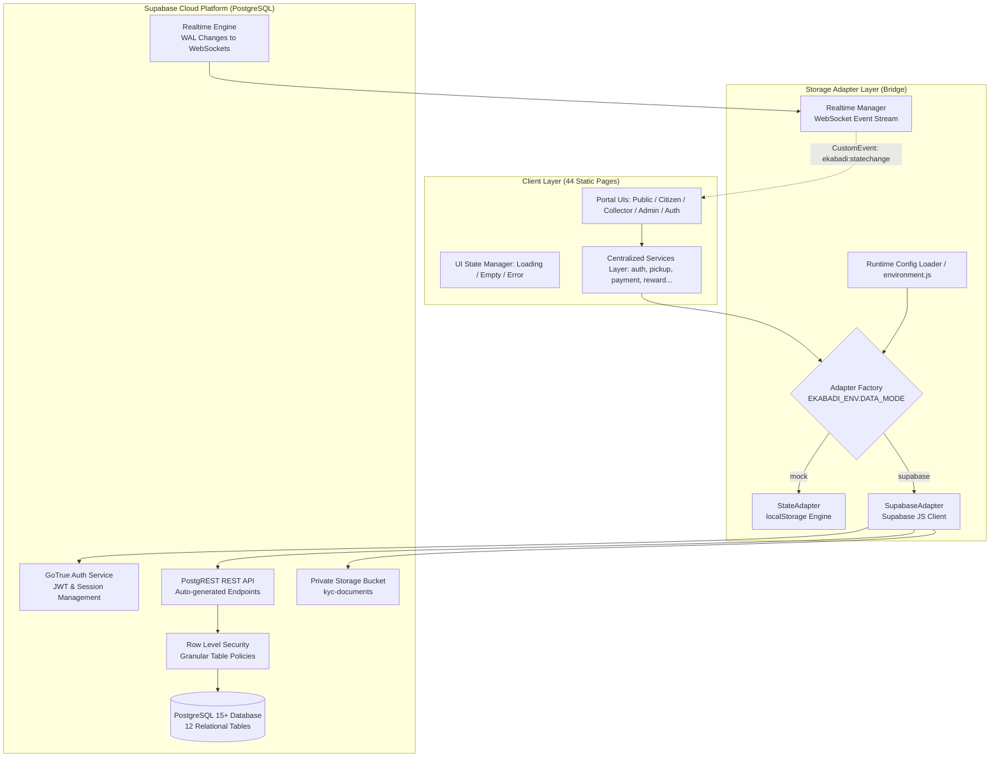

# E-Kabaadi Platform — Backend Architecture & Engineering Design

## 1. Executive Summary

E-Kabaadi is an enterprise-grade digital scrap collection, resource recovery, and circular economy platform. This document outlines the backend architecture transitioning E-Kabaadi from a local-storage prototype into a production-ready, cloud-native application powered by **Supabase (PostgreSQL, PostgREST, GoTrue Auth, Realtime, and S3-compatible Storage)**.

The architecture follows a strict **Dual-Engine Adapter Pattern**:
- **Mock Engine (`DATA_MODE=mock`)**: Zero-dependency, offline-capable localStorage state engine used for rapid prototyping, CI testing, and demonstration.
- **Supabase Engine (`DATA_MODE=supabase`)**: Production-grade cloud database with PostgreSQL relational schema, Row Level Security (RLS), atomic transactional RPCs, encrypted authentication, and live multi-client WebSocket subscriptions.

---

## 2. High-Level System Architecture



---

## 3. Storage Adapter Pattern (Dual-Engine Interface)

Both engines strictly adhere to the unified storage contract:

```typescript
interface StateAdapterInterface {
    getCollection<T>(collectionName: string): Promise<T[]> | T[];
    saveCollection<T>(collectionName: string, items: T[], action?: string): Promise<T[]> | T[];
    findById<T>(collectionName: string, id: string): Promise<T | null> | (T | null);
    insert<T>(collectionName: string, item: T): Promise<T> | T;
    update<T>(collectionName: string, id: string, updates: Partial<T>): Promise<T | null> | (T | null);
    delete(collectionName: string, id: string): Promise<boolean> | boolean;
    getSession(): Promise<AppSession | null> | (AppSession | null);
    setSession(session: AppSession | null): Promise<void> | void;
    clearSession(): Promise<void> | void;
}
```

### Table & Column Mapping:
| localStorage Collection | Supabase Table | Key Transformation |
|---|---|---|
| `users` | `profiles` | `camelCase` ↔ `snake_case`, ID references `auth.users(id)` |
| `citizens` | `citizens` | Foreign key `user_id` → `profiles(id)` |
| `collectors` | `collectors` | Foreign key `user_id` → `profiles(id)` |
| `pickups` | `pickups` | References `citizen_id` and `collector_id` |
| `payments` | `payments` | Transaction ledger linked to `pickup_id` |
| `rewards` | `reward_catalog` | Catalog items and point redemption costs |
| `rewardTransactions` | `reward_transactions` | Audit ledger for Eco Coin credits/debits |
| `notifications` | `notifications` | Targeted notifications by `user_id` / role |
| `scrapCategories` | `scrap_categories` | Material pricing master table |
| `issues` | `issues` | Support disputes and inquiries |
| `approvalAuditTrail` | `approval_audit_trail` | Immutable admin verification log |
| `aiAnalyses` | `ai_analyses` | Gemini Multimodal Vision inference logs & metadata |

---

## 4. Security & Row Level Security (RLS) Strategy

Zero-Trust data isolation is enforced at the database level using PostgreSQL Row Level Security. Even if client-side code is tampered with, PostgreSQL rejects unauthorized queries.

### Security Helpers:
```sql
-- Helper: Retrieve current user's role from JWT & profile table
CREATE OR REPLACE FUNCTION get_user_role()
RETURNS TEXT AS $$
    SELECT role FROM profiles WHERE id = auth.uid();
$$ LANGUAGE sql SECURITY DEFINER STABLE;

-- Helper: Retrieve current citizen's entity ID
CREATE OR REPLACE FUNCTION get_citizen_id()
RETURNS TEXT AS $$
    SELECT id FROM citizens WHERE user_id = auth.uid();
$$ LANGUAGE sql SECURITY DEFINER STABLE;

-- Helper: Retrieve current collector's partner ID
CREATE OR REPLACE FUNCTION get_collector_id()
RETURNS TEXT AS $$
    SELECT id FROM collectors WHERE user_id = auth.uid();
$$ LANGUAGE sql SECURITY DEFINER STABLE;
```

### RLS Policy Matrix:

| Table | Citizen | Collector | Admin | Public / Unauth |
|---|---|---|---|---|
| `profiles` | Read/Update Own | Read/Update Own | Full Read/Update | Denied |
| `citizens` | Read/Update Own | Denied | Full Read/Update | Denied |
| `collectors` | Read Active Profiles | Read/Update Own | Full Read/Update | Denied |
| `pickups` | Read/Create Own | Read/Update Assigned | Full Read/Update | Denied |
| `payments` | Read Own | Read Own | Full Read/Update | Denied |
| `scrap_categories` | Read Active | Read Active | Full CRUD | Read Active |
| `reward_catalog` | Read Active | Read Active | Full CRUD | Read Active |
| `reward_transactions`| Read Own | Read Own | Full Read | Denied |
| `notifications` | Read/Update Own | Read/Update Own | Read Admin Notifs | Denied |
| `issues` | Read/Create Own | Read/Create Own | Full Read/Update | Denied |
| `approval_audit_trail`| Denied | Denied | Full Read/Insert | Denied |
| `kyc_documents` | Insert/Read Own | Insert/Read Own | Full Read/Update | Denied |

---

## 5. KYC Privacy & Aadhaar Compliance

1. **Aadhaar Masking**:
   - In accordance with UIDAI regulations, no raw 12-digit Aadhaar numbers are persisted in plain text.
   - Values are masked on ingest: `XXXX-XXXX-1234` (only the final 4 digits are retained for verification).
2. **KYC Document Storage**:
   - Documents are uploaded to a private Supabase Storage bucket (`kyc-documents`) with `public: false`.
   - Access requires signed URLs with strict time-to-live (TTL: 60 seconds).
   - Citizens and Collectors can only upload to paths prefixed with their own `auth.uid()`.
   - Only users with role `admin` can read KYC documents across all accounts.

---

## 6. Progressive Async & Realtime Synchronization

Existing UI templates call services synchronously (`const pickups = pickupService.getAll()`). To allow zero-regression mock execution while facilitating cloud readiness:
1. **Dynamic Proxy**: `storage` in `services.js` delegates transparently to the active adapter.
2. **`resolveData(val, callback)`**: Universal handler that evaluates synchronously for mock data and asynchronously for Promises.
3. **Realtime Bridge**: `frontend/shared/js/realtime.js` listens to Postgres WAL streams on `pickups`, `payments`, and `notifications`, emitting the existing CustomEvent:
   ```javascript
   window.dispatchEvent(new CustomEvent("ekabadi:statechange", { detail: { collection, action, payload } }));
   ```
   This means all 44 existing portal pages automatically update in realtime without changing DOM render logic.

---

## 7. Atomic Business Transactions & Concurrency RPCs

Critical multi-step operations and concurrency transitions are executed atomically in PostgreSQL `SECURITY DEFINER` functions:
- `process_collection_completion`: Updates pickup status to `completed` and `paid`, records final certified weight, generates payment ledger entry, awards Eco Coins, and updates citizen & collector lifetime counters within a single atomic database transaction.
- `pickup_accept`: Uses row-level locking (`FOR UPDATE`) to atomically claim a pickup in `requested` status, preventing race conditions between concurrent collectors.
- `pickup_start_transit`: Validates the pickup is in `accepted` status before transitioning to `on_the_way`.
- `pickup_arrive`: Validates the pickup is in `on_the_way` status before transitioning to `arrived`.
- `pickup_start_collection`: Validates the pickup is in `arrived` status before transitioning to `collecting`.
- `pickup_cancel`: Enforces strict cancellation boundaries, permitting cancellation only prior to `arrived`, `collecting`, `completed`, `paid`, or `payment_pending`.
- `admin_process_application`: Atomically updates entity status (`approved`/`rejected`), profile status, and writes an immutable entry into `approval_audit_trail`.

---

## 8. Integration Boundaries

The backend schema and adapter design provide clean, isolated interfaces for external production services:
- **Payment Gateway**: Webhook-ready `payments` table with `gateway_transaction_id` and idempotency keys.
- **SMS / WhatsApp OTP**: Phone verification flag in `profiles` and audit log in `notifications`.
- **Mapping & Geocoding**: GeoJSON / JSONB coordinates schema prepared for Google Maps / Mapbox.
- **AI Material Classification (Phase 4D)**: Powered by Google Gemini Multimodal Vision (`gemini-1.5-flash`) via the `analyze-scrap` Supabase Edge Function with strict JSON schema validation, controlled category mapping, human-in-the-loop review, and certified digital scale authority.

---

## 9. Phase 4C Security Hardening Architecture

For complete details on threat modeling, privilege escalation defense, PII masking, and audit immutability, refer to [Phase 4C Security Hardening Specification](phase-4c-security-hardening.md).
- **Tamper Prevention Triggers**: Triggers `trg_prevent_profile_tampering`, `trg_prevent_citizen_tampering`, and `trg_prevent_collector_tampering` protect system-controlled columns.
- **Audit Immutability**: Triggers `trg_prevent_audit_update` and `trg_prevent_audit_delete` permanently prevent modification or deletion of audit logs.
- **Public Directory Isolation**: View `public_collectors_directory` and function `get_public_collectors()` mask all banking, KYC, and residential fields.

---

## 10. Phase 4D Gemini AI Scrap Intelligence Architecture

For full specifications on multimodal inference, server-side secret isolation, structured schema constraints, category mapping, and doorstep scale finality, refer to [Phase 4D Gemini AI Scrap Intelligence](phase-4d-gemini-ai.md).
- **Zero Frontend Secrets**: `GEMINI_API_KEY` resides strictly within the `analyze-scrap` Edge Function environment.
- **Financial Integrity**: AI estimates weight and material; scrap rates and payout calculations are strictly derived from trusted database catalogs (`scrap_categories`).
- **Certified Scale Authority**: Doorstep certified digital scale readings override all AI estimates during collection finalization.
- **Analytics & Accuracy**: RPC `get_ai_analysis_stats()` aggregates AI performance and user correction metrics for administrative oversight.


