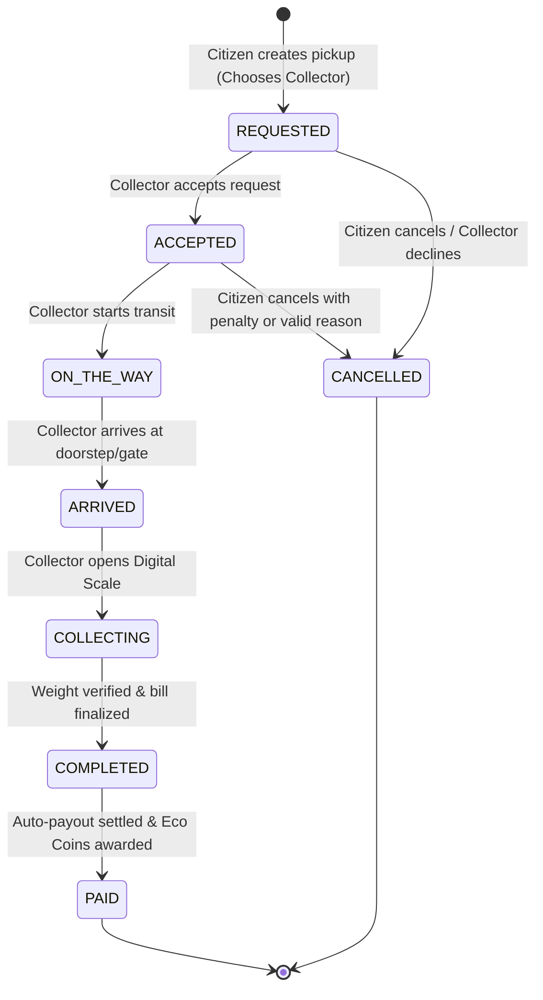

# E-Kabaadi Data Model & Architecture Specification
**Version**: 2.0.0 (Phase 2 Frontend Engine & Future Supabase/PostgreSQL Schema)  
**Date**: September 2026  
**Status**: Approved Specification  

---

## 1. Overview & Architectural Principles

This document specifies the centralized entities, state machines, and data relationships powering the E-Kabaadi platform. 

The application uses an **Adapter Pattern** (`StateAdapter` in `frontend/shared/js/storage.js` and `frontend/shared/js/services.js`). During prototype and hackathon demonstration, this adapter is backed by an in-browser unified reactive `localStorage` engine with event broadcasting. Future backend migration (Supabase/PostgreSQL + Node.js) simply replaces this adapter with REST/RPC calls without altering any page-level UI code.

---

## 2. Core Entities & Table Schemas

### 2.1 `users`
Represents authentication and universal credentials across all platform roles.

| Column | Type | Constraints | Description |
|---|---|---|---|
| `id` | UUID / String | PK, unique | e.g., `USR-CIT-001`, `USR-COL-001`, `USR-ADMIN-001` |
| `role` | VARCHAR(20) | NOT NULL | `citizen` \| `collector` \| `admin` |
| `email` | VARCHAR(255) | UNIQUE, NOT NULL | Login email address |
| `phone` | VARCHAR(20) | UNIQUE, NOT NULL | Primary contact phone |
| `password_hash` | VARCHAR(255) | NOT NULL | Password hash / demo password |
| `first_name` | VARCHAR(100) | NOT NULL | First name |
| `last_name` | VARCHAR(100) | NOT NULL | Last name |
| `avatar` | VARCHAR(10) | NULL | Initials or URL avatar |
| `status` | VARCHAR(30) | NOT NULL | `active` \| `pending_approval` \| `rejected` \| `suspended` |
| `application_status` | VARCHAR(30) | NOT NULL | `draft` \| `pending_approval` \| `approved` \| `rejected` \| `correction_required` |
| `phone_verified` | BOOLEAN | DEFAULT FALSE | Phone OTP verification flag |
| `email_verified` | BOOLEAN | DEFAULT FALSE | Email verification flag |
| `created_at` | TIMESTAMP | DEFAULT NOW() | Registration timestamp |
| `updated_at` | TIMESTAMP | DEFAULT NOW() | Last update timestamp |

---

### 2.2 `citizens`
Extended profile for consumer scrap sellers.

| Column | Type | Constraints | Description |
|---|---|---|---|
| `id` | UUID / String | PK, unique | e.g., `CIT-1001` |
| `user_id` | UUID / String | FK (`users.id`), NOT NULL | Associated user reference |
| `name` | VARCHAR(200) | NOT NULL | Full display name |
| `addresses` | JSONB | NOT NULL | Array of saved addresses (`id`, `label`, `address`, `city`, `pin`, `isDefault`) |
| `primary_address` | TEXT | NOT NULL | Primary default address string |
| `kyc_status` | VARCHAR(30) | NOT NULL | `pending` \| `verified` \| `rejected` |
| `payout_method` | VARCHAR(50) | NOT NULL | `UPI` \| `Bank Transfer` \| `Cash` |
| `upi_id` | VARCHAR(100) | NULL | Masked UPI ID (e.g. `aarav@okaxis`) |
| `eco_coins` | INTEGER | DEFAULT 0 | Current reward balance |
| `total_earnings` | DECIMAL(10,2)| DEFAULT 0.00 | Lifetime rupees earned from scrap |
| `total_pickups` | INTEGER | DEFAULT 0 | Count of total pickups initiated |
| `completed_pickups`| INTEGER | DEFAULT 0 | Count of completed pickups |
| `total_waste_sold` | DECIMAL(8,2) | DEFAULT 0.00 | Total kilograms of scrap recycled |
| `rating` | DECIMAL(3,2) | DEFAULT 5.00 | Average rating given by collectors |

---

### 2.3 `collectors`
Extended profile for independent scrap collection partners.

| Column | Type | Constraints | Description |
|---|---|---|---|
| `id` | UUID / String | PK, unique | e.g., `COL-2001` |
| `user_id` | UUID / String | FK (`users.id`), NOT NULL | Associated user reference |
| `name` | VARCHAR(200) | NOT NULL | Partner full name |
| `business_name` | VARCHAR(200) | NOT NULL | Enterprise or fleet name |
| `vehicle_type` | VARCHAR(50) | NOT NULL | `Three-Wheeler Tempo` \| `Pickup Truck` \| `Mini Truck` |
| `vehicle_number` | VARCHAR(30) | NOT NULL | e.g., `UP 16 AB 1234` |
| `service_radius` | INTEGER | NOT NULL | Service radius in kilometers (e.g., 8 km) |
| `service_area` | VARCHAR(255) | NOT NULL | Area covered (e.g., `Sector 15-65, Noida`) |
| `accepted_materials`| JSONB | NOT NULL | Array of scrap categories (e.g., `["Paper", "Plastic", "Metal"]`) |
| `rating` | DECIMAL(3,2) | DEFAULT 4.80 | Average customer rating |
| `total_pickups` | INTEGER | DEFAULT 0 | Lifetime pickups assigned |
| `completed_pickups`| INTEGER | DEFAULT 0 | Lifetime pickups completed |
| `is_online` | BOOLEAN | DEFAULT TRUE | Real-time radar availability flag |
| `queue_length` | INTEGER | DEFAULT 0 | Active scheduled jobs in queue |
| `verification_status`| VARCHAR(30) | NOT NULL | `verified` \| `pending` \| `rejected` |
| `scale_status` | VARCHAR(50) | DEFAULT 'certified' | Trade calibrated scale flag (`#EKB-402`) |
| `bank_details` | JSONB | NOT NULL | Masked bank account & IFSC |

---

### 2.4 `pickups`
The central transaction entity connecting Citizen, Collector, and Admin.

> **CRITICAL RULE**: The `collector_id` is ALWAYS chosen directly by the Citizen. The Admin supervises but NEVER assigns collectors.

| Column | Type | Constraints | Description |
|---|---|---|---|
| `id` | VARCHAR(30) | PK, unique | e.g., `PK-9481`, `PK-9501` |
| `citizen_id` | VARCHAR(30) | FK (`citizens.id`), NOT NULL | Citizen reference |
| `citizen_name` | VARCHAR(200) | NOT NULL | Citizen snapshot name |
| `collector_id` | VARCHAR(30) | FK (`collectors.id`), NOT NULL | Selected collector reference |
| `collector_name` | VARCHAR(200) | NOT NULL | Selected collector snapshot name |
| `scrap_items` | JSONB | NOT NULL | Items list: `category`, `type`, `estimatedWeight`, `verifiedWeight`, `rate` |
| `estimated_weight` | DECIMAL(8,2) | NOT NULL | Estimated total kg |
| `estimated_value` | DECIMAL(10,2)| NOT NULL | Estimated total rupees |
| `final_weight` | DECIMAL(8,2) | NULL | Actual weighed kg on doorstep |
| `final_value` | DECIMAL(10,2)| NULL | Actual calculated payout: $\sum(weight \times rate)$ |
| `address` | TEXT | NOT NULL | Full pickup address |
| `scheduled_date` | VARCHAR(50) | NOT NULL | e.g. `2026-09-24` |
| `scheduled_time` | VARCHAR(50) | NOT NULL | Slot e.g. `10:00 AM - 12:00 PM` |
| `status` | VARCHAR(30) | NOT NULL | State machine status (see §3) |
| `payment_status` | VARCHAR(30) | DEFAULT 'pending'| `pending` \| `paid` \| `failed` |
| `created_at` | TIMESTAMP | DEFAULT NOW() | Booking timestamp |
| `accepted_at` | TIMESTAMP | NULL | Collector acceptance timestamp |
| `enroute_at` | TIMESTAMP | NULL | Collector transit timestamp |
| `arrived_at` | TIMESTAMP | NULL | Collector arrival timestamp |
| `completed_at` | TIMESTAMP | NULL | Scale completion timestamp |
| `cancelled_at` | TIMESTAMP | NULL | Cancellation timestamp |
| `cancellation_reason`| TEXT | NULL | Reason if cancelled |

---

### 2.5 `payments`
Financial disbursement ledger generated automatically upon collection completion.

| Column | Type | Constraints | Description |
|---|---|---|---|
| `id` | VARCHAR(30) | PK, unique | e.g., `TXN-9481`, `PAY-9501` |
| `pickup_id` | VARCHAR(30) | FK (`pickups.id`), NOT NULL | Associated pickup |
| `citizen_id` | VARCHAR(30) | FK (`citizens.id`), NOT NULL | Recipient citizen |
| `collector_id` | VARCHAR(30) | FK (`collectors.id`), NOT NULL | Disbursing collector partner |
| `amount` | DECIMAL(10,2)| NOT NULL | Final payout amount |
| `method` | VARCHAR(30) | NOT NULL | `UPI` \| `Bank Transfer` \| `Cash` |
| `status` | VARCHAR(30) | NOT NULL | `paid` \| `pending` \| `failed` |
| `transaction_id`| VARCHAR(100) | NOT NULL | Gateway transaction reference |
| `created_at` | TIMESTAMP | DEFAULT NOW() | Payment timestamp |

---

### 2.6 `rewards` & `reward_transactions`
Eco Coins ledger and redemption transactions.

| Column | Type | Constraints | Description |
|---|---|---|---|
| `id` | VARCHAR(30) | PK, unique | e.g., `RWD-TXN-001` |
| `user_id` | VARCHAR(30) | FK (`users.id`), NOT NULL | Recipient user |
| `type` | VARCHAR(30) | NOT NULL | `earned_pickup` \| `redeemed_perk` \| `bonus` |
| `points` | INTEGER | NOT NULL | Positive (earned) or negative (redeemed) |
| `pickup_id` | VARCHAR(30) | NULL | Optional pickup source reference |
| `description` | TEXT | NOT NULL | Description e.g., `Eco Coins earned from Pickup PK-9481` |
| `created_at` | TIMESTAMP | DEFAULT NOW() | Transaction timestamp |

---

### 2.7 `issues` (Support Complaints & Disputes)
Disputes filed by Citizens or Collectors and managed by Admin.

| Column | Type | Constraints | Description |
|---|---|---|---|
| `id` | VARCHAR(30) | PK, unique | e.g., `ISS-4001` |
| `raised_by` | VARCHAR(200) | NOT NULL | Citizen or Collector display name |
| `user_id` | VARCHAR(30) | FK (`users.id`), NOT NULL | Filing user ID |
| `role` | VARCHAR(20) | NOT NULL | `citizen` \| `collector` |
| `category` | VARCHAR(50) | NOT NULL | `payment` \| `pickup` \| `scale_weight` \| `verification` \| `app` |
| `title` | VARCHAR(255) | NOT NULL | Issue title |
| `description` | TEXT | NOT NULL | Issue detailed explanation |
| `priority` | VARCHAR(20) | DEFAULT 'medium' | `low` \| `medium` \| `high` |
| `status` | VARCHAR(30) | DEFAULT 'open' | `open` \| `investigating` \| `resolved` \| `closed` |
| `assigned_to` | VARCHAR(100) | DEFAULT 'Operations Team' | Admin team handler |
| `created_at` | TIMESTAMP | DEFAULT NOW() | Ticket created timestamp |
| `updated_at` | TIMESTAMP | DEFAULT NOW() | Ticket status update timestamp |

---

### 2.8 `approval_audit_trail`
Audit log recording every approval, rejection, or correction requested by Admin.

| Column | Type | Constraints | Description |
|---|---|---|---|
| `id` | VARCHAR(30) | PK, unique | e.g., `AUD-8821` |
| `entity_type` | VARCHAR(30) | NOT NULL | `citizen` \| `collector` |
| `entity_id` | VARCHAR(30) | NOT NULL | Referenced citizen/collector ID |
| `reviewer_name`| VARCHAR(100) | NOT NULL | e.g., `Bhavya Bothera (Super Admin)` |
| `action` | VARCHAR(30) | NOT NULL | `APPROVE` \| `REJECT` \| `REQUEST_CORRECTION` |
| `reason` | TEXT | NULL | Justification or required correction notes |
| `created_at` | TIMESTAMP | DEFAULT NOW() | Audit event timestamp |

---

## 3. Pickup State Machine

### State Definitions & Rules:
1. `REQUESTED`: Initial state when Citizen selects Collector and clicks "Confirm Pickup".
2. `ACCEPTED`: Collector clicks "Accept" in `requests.html`.
3. `ON_THE_WAY`: Collector departs and enables live GPS navigation in `active-pickup.html`.
4. `ARRIVED`: Collector reaches citizen society gate or doorstep.
5. `COLLECTING`: Collector launches digital scale in `collection.html` and weighs scrap lot.
6. `COMPLETED`: Weighing confirmed and finalized. Final weight and final payout are recorded.
7. `PAID`: Payment gateway dispatches rupees via UPI; Eco Coins are credited to Citizen reward balance.
8. `CANCELLED`: Permitted only while in `REQUESTED` or `ACCEPTED` states before collector travels.
