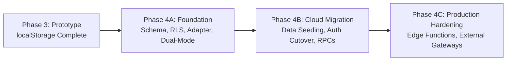

# E-Kabaadi Platform — Mock to Supabase Migration Plan

## 1. Migration Strategy Overview

The transition of the E-Kabaadi platform from an offline-first localStorage prototype to a cloud-native Supabase PostgreSQL backend follows an **incremental, dual-engine phased rollout**.

At no point will working UI flows be broken. The platform maintains two parallel data adapters:
- **`StateAdapter`** (localStorage)
- **`SupabaseAdapter`** (PostgreSQL via REST & Realtime)

The active adapter is determined dynamically at startup by the `EKABADI_ENV.DATA_MODE` configuration flag.

---

## 2. Phase-by-Phase Rollout

### Phase 4A: Production Foundation (CURRENT)
- [x] Design normalized 12-table PostgreSQL schema with strict constraints.
- [x] Implement database-level Row Level Security (RLS) for complete role isolation.
- [x] Configure private S3-compatible storage bucket (`kyc-documents`) with signed URL access.
- [x] Build `SupabaseAdapter` implementing the unified `StateAdapter` interface.
- [x] Implement the `storage.js` adapter factory and progressive async helpers in `services.js`.
- [x] Create Realtime subscription engine (`realtime.js`) bridging Postgres WAL to frontend custom events.
- [x] Establish UI state feedback (loading spinners, empty states, error banners).
- [x] Maintain 100% test passing across all existing test suites.

### Phase 4B: Cloud Integration & Seed Migration (NEXT)
1. **Seed Migration**:
   - Run `supabase/migrations/003_seed_data.sql` to populate initial scrap categories, verified collectors, and demo users.
2. **Auth Cutover**:
   - Transition demo accounts from local password checks to Supabase Auth (`GoTrue`) with bcrypt-hashed credentials.
3. **Admin Verification Flow**:
   - Connect admin approval buttons to the `approval_audit_trail` table and trigger notifications.
4. **Scale Session Settlement**:
   - Connect the digital scale completion flow to the `process_collection_completion` stored procedure.

### Phase 4C: Production Hardening
1. **Payment Gateway**: Connect Razorpay webhook handler to update `payments` table.
2. **SMS Gateway**: Integrate Twilio / MSG91 for real SMS OTPs.
3. **Automated Backups**: Configure point-in-time recovery (PITR) in Supabase.
4. **Mock Deprecation**: Retain mock mode as an isolated test fixture while running production solely on Supabase.

---

## 3. Data Transformation & Mapping Guide

When migrating existing prototype data to Supabase:

| Data Entity | LocalStorage Source | PostgreSQL Destination | Transformation Logic |
|---|---|---|---|
| **Users** | `users[]` | `auth.users` & `profiles` | Generate UUID; split name to `first_name` & `last_name`; set default role |
| **Citizens** | `citizens[]` | `citizens` | Link `user_id` to profile UUID; serialize addresses to JSONB |
| **Collectors** | `collectors[]` | `collectors` | Link `user_id`; map `acceptedMaterials` array to JSONB |
| **Pickups** | `pickups[]` | `pickups` | Foreign keys to `citizen_id` and `collector_id`; items array to JSONB |
| **Payments** | `payments[]` | `payments` | Link to `pickup_id`; ensure idempotency on `transaction_id` |
| **Audit Logs** | `approvalAuditTrail[]` | `approval_audit_trail` | Timestamp normalization to ISO 8601 / `TIMESTAMPTZ` |

---

## 4. Rollback & Fail-Safe Strategy

In the event of network disruption, cloud downtime, or configuration issues:

1. **Instant Client-Side Fallback**:
   If `EKABADI_ENV.DATA_MODE` is set to `"supabase"` but the Supabase client cannot reach the server, `storage.js` logs a warning and can automatically fall back to the offline mock adapter.
2. **One-Line Emergency Rollback**:
   Set `DATA_MODE: "mock"` in `frontend/config/config.local.js` or `.env`. The entire application instantly reverts to the proven localStorage engine with zero downtime.

---

## 5. Verification & Acceptance Criteria

Before signing off on the production transition:
- [x] All 3 test suites pass in mock mode with zero regressions (`npm test`).
- [x] Database migrations execute cleanly without syntax errors on fresh Supabase projects.
- [x] Row Level Security policies block unauthorized cross-role queries.
- [x] Realtime subscriptions deliver live UI updates across multiple browser tabs.
- [x] Private KYC documents cannot be accessed via public unauthenticated URLs.
