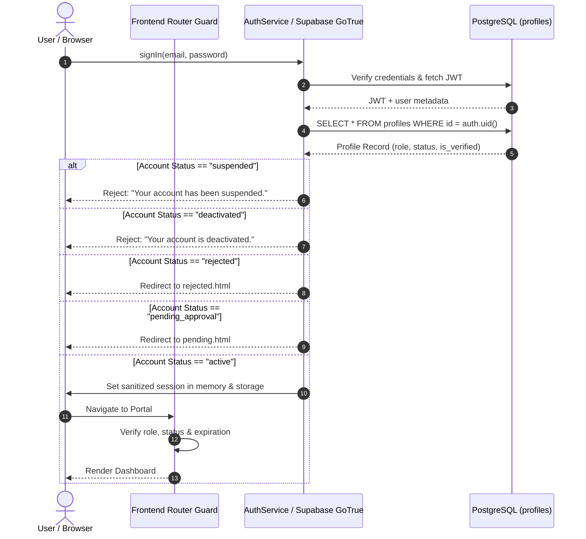

# E-Kabaadi Platform — Phase 4C Security, Integrity & Hardening Specification

## 1. Threat Model

The E-Kabaadi platform operates as a multi-tenant clean-tech waste management ecosystem connecting three primary user tiers:
1. **Citizens** (Household and commercial scrap generators)
2. **Collectors** (Independent scrap collectors and fleet drivers)
3. **Admins** (Municipal control center operators and platform verifiers)

Because E-Kabaadi handles monetary payouts (UPI transactions), redeemable digital assets (Eco Coins), sensitive PII (Aadhaar cards, bank details), and verified physical scrap trades, it faces specific threat vectors:

### Threat Actors & Motives
- **Malicious Citizens / Attackers**: Motivated by financial fraud (forging collection weights to trigger inflated UPI payouts), unauthorized coin accumulation (arbitrary wallet crediting), privilege escalation (altering role to `admin`), or identity spoofing.
- **Rogue Collectors**: Motivated by claiming or tampering with pickups outside their service route, bypassing physical scale certification, tampering with rate multipliers, or inspecting competitor routes/citizen addresses.
- **External Attackers**: Motivated by stealing government identity documents (Aadhaar PDFs/images), exfiltrating user directories, executing Cross-Site Scripting (XSS) to hijack sessions, or spoofing webhook callbacks.
- **Compromised Frontend Clients**: Any attacker running modified JavaScript in browser DevTools or executing direct PostgREST REST calls with an anonymous key or hijacked JWT.

### Core Attack Surfaces & Mitigations
| Attack Vector | Vulnerability Pre-Phase 4C | Phase 4C Defense / Mitigation |
|---|---|---|
| **Role Elevation via REST** | Client sends `PATCH /rest/v1/profiles` with `{ "role": "admin" }` | PostgreSQL trigger `trg_prevent_profile_tampering` rejects non-admin changes to `role`, `status`, or `is_verified`. |
| **System Field Injection** | Client sends `PATCH /rest/v1/citizens` with `{ "wallet_balance": 99999 }` | PostgreSQL trigger `trg_prevent_citizen_tampering` rejects non-admin modifications to balance, earnings, eco coins, or KYC status. |
| **Public KYC Exposure** | Public read access on KYC storage or predictable URLs | Private storage bucket (`public = false`), storage RLS policies restricting read to owner and admin, 60-second expiring signed URLs. |
| **Collector Directory Exfiltration**| Citizens/Competitors querying full collector records exposing bank accounts and private documents | PostgreSQL view `public_collectors_directory` with `security_barrier` and SQL function `get_public_collectors()`, returning only business name, vehicle, rating, and operational status. |
| **Pickup Race Conditions** | Two collectors accepting the same pickup simultaneously | Atomic RPC `pickup_accept` using PostgreSQL row-level locking (`FOR UPDATE`). |
| **Invalid State Transitions** | Client jumping directly from `requested` to `completed` or `paid` | Atomic RPC state machine (`pickup_start_transit`, `pickup_arrive`, `pickup_start_collection`, `process_collection_completion`) checking exact preceding status. |
| **Post-Arrival Cancellation** | Citizen cancelling pickup while collector is weighing or paying | `pickup_cancel` RPC strictly rejects cancellation once status reaches `arrived`, `collecting`, `completed`, `paid`, or `payment_pending`. |
| **Duplicate Payments & Rewards** | Repeated network retries or malicious concurrent calls crediting payouts twice | Idempotency checks in `process_collection_completion`, unique index on `payments(pickup_id)`, and composite unique constraint on `reward_transactions(pickup_id, type)`. |
| **Direct Payment/Reward Injections**| Client directly executing `POST /rest/v1/payments` with fabricated ledger entries | Database RLS policy: client `INSERT` denied on `payments` and `reward_transactions`; all records created via `SECURITY DEFINER` RPCs. |
| **Audit Trail Tampering** | Rogue actor altering or deleting approval records | Append-only audit table protected by PostgreSQL triggers `trg_prevent_audit_update` and `trg_prevent_audit_delete` which raise exceptions on any UPDATE/DELETE. |
| **Session Hijacking via Stored Tokens**| Raw JWT tokens stored in unencrypted browser storage exposed to XSS | Sanitized session cache (`sanitizeSessionForStorage`) strips sensitive tokens from localStorage; explicit expiration checks (`isSessionValid`). |
| **Persistent Stored XSS** | Malicious script payload in address, notes, or scrap descriptions | Defense-in-depth HTML escaping (`escapeHtml`), input sanitization (`sanitizeInput`), and content stripping. |

---

## 2. Authentication Architecture

E-Kabaadi implements a secure authentication flow leveraging Supabase GoTrue with client-side state guarding:



### Key Authentication Safeguards
1. **No Fake Success**: Connection failures or unconfigured credentials strictly throw errors or return mock status with explicit banners.
2. **Account Status Gating**:
   - `active`: Normal authenticated access granted.
   - `pending_approval`: Redirected to `auth/pending-approval.html` (blocked from operational dashboards).
   - `rejected`: Redirected to `auth/rejected.html` (blocked from all portal functions).
   - `suspended`: Session invalidated; redirected to `login.html?error=suspended`.
   - `deactivated`: Session purged; redirected to `login.html?error=deactivated`.
3. **Password Recovery**:
   - Implements two-stage password recovery via `authService.resetPassword(email)` and `authService.updatePassword(newPassword)`.
   - Uses neutral security messaging on submission (*"If an account exists with that email, a password reset link has been dispatched"*), preventing user enumeration.
4. **Phone Verification**:
   - Production phone verification interface `phoneVerificationService` defined with standard contract (`sendVerificationOtp`, `verifyOtp`).
   - Mock verification uses sandbox tokens; production interface designed for Twilio Verify or Supabase Phone Auth.

---

## 3. Authorization Architecture (RBAC)

Authorization is enforced at both the client route level and the database level:

### Role Matrix
| Role | Portal Entry | Allowed Operations | Forbidden Operations |
|---|---|---|---|
| **Citizen** | `/frontend/citizen/dashboard.html` | Book pickups, view own bookings, cancel own uncollected pickups, manage own addresses, redeem earned coins, submit support tickets. | Cannot accept pickups, cannot update scrap rates, cannot view other citizens' data, cannot approve accounts. |
| **Collector** | `/frontend/collector/dashboard.html` | View assigned queue, advance pickup states (`accepted` -> `on_the_way` -> `arrived` -> `collecting`), run scale weighing, record certified weights, complete collections. | Cannot approve accounts, cannot alter official scrap rates, cannot see unrelated citizens' private profiles. |
| **Admin** | `/frontend/admin/dashboard.html` | Review and approve/reject applicants, manage scrap rates, view platform KPIs, monitor audit trail, resolve issues. | Cannot forge customer wallet payouts outside valid collections. |
| **Public** | `/frontend/public/index.html` | View live rates, public collector directory (sanitized), calculate estimated scrap value. | Cannot access any internal portal or private API. |

### Route Guard Enforcement
The frontend router (`frontend/shared/js/router.js`) inspects the active session before every page render:
- `router.requireAuth(requiredRole)`:
  - If no session exists: saves current path in `returnUrl` and redirects to `login.html`.
  - If session expired: clears storage and redirects to `login.html?error=session_expired`.
  - If status is `suspended` or `deactivated`: clears storage and redirects to status error page.
  - If status is `pending_approval` or `rejected`: redirects to status landing page.
  - If session role does not match `requiredRole` (and user is not an `admin` inspecting routes): redirects to user's authorized home portal.

---

## 4. Row Level Security (RLS) Strategy

Row Level Security is enabled on **all 12 PostgreSQL database tables** (`ALTER TABLE ... ENABLE ROW LEVEL SECURITY`). RLS policies use PostgreSQL session context (`auth.uid()`) and security definer functions (`get_user_role()`, `get_citizen_id()`, `get_collector_id()`).

### Helper Functions
```sql
CREATE OR REPLACE FUNCTION get_user_role()
RETURNS TEXT AS $$
    SELECT role FROM profiles WHERE id = auth.uid();
$$ LANGUAGE sql SECURITY DEFINER STABLE;

CREATE OR REPLACE FUNCTION get_citizen_id()
RETURNS TEXT AS $$
    SELECT id FROM citizens WHERE user_id = auth.uid();
$$ LANGUAGE sql SECURITY DEFINER STABLE;

CREATE OR REPLACE FUNCTION get_collector_id()
RETURNS TEXT AS $$
    SELECT id FROM collectors WHERE user_id = auth.uid();
$$ LANGUAGE sql SECURITY DEFINER STABLE;
```

### Table-by-Table Policy Summary
1. **`profiles`**:
   - `SELECT`: Users read their own profile (`id = auth.uid()`); Admins read all profiles.
   - `UPDATE`: Users update their own profile; Admins update all profiles.
   - **Protection Trigger**: `trg_prevent_profile_tampering` blocks non-admin updates to `role`, `status`, or `is_verified`.
2. **`citizens`**:
   - `SELECT`: Citizens read own record (`user_id = auth.uid()`); Admins read all.
   - `UPDATE`: Citizens update own address/phone; Admins update all.
   - **Protection Trigger**: `trg_prevent_citizen_tampering` blocks non-admin updates to financial/verification columns.
3. **`collectors`**:
   - `SELECT`: Collectors read own record (`user_id = auth.uid()`); Admins read all.
   - Public view: `public_collectors_directory` exposes masked fields for active, verified collectors.
   - **Protection Trigger**: `trg_prevent_collector_tampering` blocks non-admin updates to certification, rating, or balance.
4. **`pickups`**:
   - `SELECT`: Citizens read own pickups (`citizen_id = get_citizen_id()`); Collectors read assigned pickups (`collector_id = get_collector_id()`); Admins read all.
   - `INSERT`: Citizens create pickups where `citizen_id = get_citizen_id()`.
   - `UPDATE`: Citizens can cancel their own pickups (prior to arrival); Collectors can update assigned pickups; Admins can update all.
   - **State Machine RPCs**: Transition logic runs in atomic security-definer stored procedures.
5. **`payments`**:
   - `SELECT`: Citizens read payments for their pickups; Collectors read payments for their pickups; Admins read all.
   - `INSERT`: Direct unprivileged client INSERT is denied. All records created via `process_collection_completion` RPC.
6. **`reward_transactions`**:
   - `SELECT`: Citizens read own transactions; Admins read all.
   - `INSERT`: Direct unprivileged client INSERT is denied.
7. **`approval_audit_trail`**:
   - `SELECT`: Admins only.
   - `INSERT`: Admins only.
   - `UPDATE` & `DELETE`: Denied for all users via PostgreSQL triggers.
8. **`scrap_categories`**:
   - `SELECT`: Public / authenticated read for active categories.
   - `ALL`: Admins only.
9. **`reward_catalog`**:
   - `SELECT`: Public / authenticated read for active rewards.
   - `ALL`: Admins only.
10. **`notifications`**:
    - `SELECT` & `UPDATE`: Target user only (`user_id = auth.uid()`).
11. **`issues`**:
    - `SELECT` & `INSERT`: User reads/creates own issues (`user_id = auth.uid()`); Admins manage all issues.

---

## 5. KYC Security

Know Your Customer (KYC) documentation is mandatory for both Citizens and Collectors prior to receiving collection services or initiating collection routes.

### Storage Bucket Isolation
- Storage bucket `kyc-documents` is configured with `public = false`.
- Direct anonymous or public downloads are strictly blocked at the S3/storage gateway layer.
- Files must be stored under hierarchical paths: `{user_id}/{document_type}_{timestamp}.{ext}`.

### Storage RLS Policies
```sql
-- Upload: Users can only upload to their own user_id directory
CREATE POLICY "Users upload own KYC"
ON storage.objects FOR INSERT TO authenticated
WITH CHECK (
    bucket_id = 'kyc-documents' AND
    (storage.foldername(name))[1] = auth.uid()::text
);

-- View: Users can view their own documents; Admins can view all documents
CREATE POLICY "Users and admins view KYC"
ON storage.objects FOR SELECT TO authenticated
USING (
    bucket_id = 'kyc-documents' AND (
        (storage.foldername(name))[1] = auth.uid()::text OR
        get_user_role() = 'admin'
    )
);
```

### Time-Limited Expiring Signed URLs
- When an Admin or user inspects a KYC document, the client requests a signed URL via `supabase.storage.from('kyc-documents').createSignedUrl(path, 60)`.
- The signed URL contains a cryptographically secure token that expires after **60 seconds**.
- No raw storage URLs are ever embedded in persistent database rows or HTML templates.

---

## 6. Sensitive Data Policy (PII Masking)

To comply with UIDAI guidelines, RBI regulations, and privacy standards, sensitive PII is strictly masked before rendering or exposure:

### Aadhaar Masking
- Format: `XXXX-XXXX-1234`
- Full 12-digit Aadhaar numbers are never displayed in client views or logged.
- The `maskAadhaar(val)` utility preserves only the final 4 digits, replacing all preceding digits with uppercase `X` groupings.

### Bank Account Masking
- Format: `••••••••1234`
- Full bank account numbers are masked, revealing only the final 4 digits to prevent unauthorized financial exposure.

### Collector Public Directory Masking
- Citizens select verified collectors via the directory.
- The directory query uses `public_collectors_directory` or `get_public_collectors()`, which strips:
  - Bank account numbers
  - IFSC codes
  - Private KYC document URLs
  - Residential addresses
  - System timestamps
- Only public professional fields (Full name, business name, vehicle number, service zone, verified status, rating) are returned.

---

## 7. Pickup Lifecycle & Concurrency Integrity

The pickup state machine is enforced by strict business rules and atomic database procedures.

### Lifecycle Diagram
```text
REQUESTED ──> ACCEPTED ──> ON_THE_WAY ──> ARRIVED ──> COLLECTING ──> COMPLETED ──> PAID
    │             │
    └──> CANCELLED <─── (Allowed ONLY prior to ARRIVED status)
```

### Concurrency Protection (`FOR UPDATE`)
To prevent race conditions when two collectors attempt to claim the same pickup, state transitions are handled by PostgreSQL RPCs using row-level locking:

```sql
CREATE OR REPLACE FUNCTION pickup_accept(p_pickup_id UUID, p_collector_id TEXT)
RETURNS JSONB AS $$
DECLARE
    v_pickup RECORD;
BEGIN
    -- Row-level lock to prevent concurrent claims
    SELECT * INTO v_pickup FROM pickups WHERE id = p_pickup_id FOR UPDATE;
    
    IF v_pickup.status != 'requested' THEN
        RETURN jsonb_build_object('success', false, 'error', 'Pickup is no longer available');
    END IF;
    
    UPDATE pickups
    SET status = 'accepted', collector_id = p_collector_id, updated_at = NOW()
    WHERE id = p_pickup_id;
    
    RETURN jsonb_build_object('success', true);
END;
$$ LANGUAGE plpgsql SECURITY DEFINER;
```

### Cancellation Boundary Enforcement
- Citizens can only cancel pickups they own (`citizen_id = current_user`).
- Cancellation is strictly forbidden once a pickup reaches `arrived`, `collecting`, `completed`, `paid`, or `payment_pending`.
- Attempting to cancel an arrived or weighed pickup throws an error: `"Cannot cancel pickup once collector has arrived or collection is underway."`

---

## 8. Payment Integrity

Payment settlement represents the transfer of real financial value (UPI transfer) and must be safeguarded against duplication and spoofing:

1. **Client INSERT Denied**: No client (Citizen, Collector, or Admin) can execute an `INSERT` directly on `payments`.
2. **Atomic Settlement (`process_collection_completion`)**:
   - The stored procedure verifies the pickup status is `collecting` or `completed`.
   - Acquires a row lock on the pickup.
   - Computes total scrap value from certified items.
   - Creates a transaction record in `payments` with unique `transaction_id`.
   - Advances pickup status to `paid`.
   - Updates citizen's total earnings and collector's operational metrics.
3. **Idempotency Guarantee**:
   - The procedure checks if a payment already exists for the given `pickup_id`.
   - If already paid, it returns `{ success: true, alreadyCompleted: true }` without generating a duplicate payout or crediting additional coins.
   - The database enforces a `UNIQUE(pickup_id)` constraint on `payments`.

---

## 9. Reward Integrity (Eco Coins)

Eco Coins are awarded to Citizens for recycling clean scrap (standard rate: 2 Eco Coins per kg).

1. **Client INSERT Denied**: The `reward_transactions` table rejects direct client-side insertions.
2. **Atomic Crediting**: Coins are credited exclusively inside the `process_collection_completion` transaction.
3. **Double-Credit Prevention**:
   - The database enforces a composite unique constraint: `UNIQUE(pickup_id, type)`.
   - Attempting to credit coins twice for the same pickup raises a unique violation error.
4. **Redemption Safeguards**: Coin redemptions verify that the citizen has sufficient current balance before decrementing wallet coins and generating voucher codes.

---

## 10. Audit Trail Integrity

All administrative actions (account approval, rejection, suspension, rate adjustments) are logged to `approval_audit_trail`:

### Immutable Audit Records
- The table schema records: `entity_type`, `entity_id`, `action`, `reviewer_id`, `reviewer_name`, `reason`, `changes`, `created_at`.
- The `reviewer_id` is automatically set to `auth.uid()`, preventing an administrator or rogue user from attributing actions to someone else.
- PostgreSQL triggers `trg_prevent_audit_update` and `trg_prevent_audit_delete` permanently forbid updates and deletions:
  ```sql
  CREATE OR REPLACE FUNCTION prevent_audit_tampering()
  RETURNS TRIGGER AS $$
  BEGIN
      RAISE EXCEPTION 'Audit trail records are strictly immutable and cannot be updated or deleted.';
  END;
  $$ LANGUAGE plpgsql;
  ```

---

## 11. Session Security

1. **Sanitized Storage**:
   - Storing raw JWT tokens in browser `localStorage` exposes long-lived credentials to DOM-based XSS attacks.
   - `sanitizeSessionForStorage(session)` strips sensitive tokens and retains only essential routing metadata (`userId`, `role`, `status`, `expiresAt`, `user`).
2. **Session Expiration**:
   - Sessions include an `expiresAt` timestamp (default: 8 hours).
   - `isSessionValid(session)` checks expiration on every route change and service call.
   - Expired sessions are automatically cleared, and the user is redirected to `login.html?error=session_expired`.
3. **Storage Isolation**:
   - The mock engine uses namespaced storage keys (`ekabadi_session`, `ekabadi_users`, etc.).
   - Logging out triggers `storage.clearSession()`, clears memory state, and fires the `session:logout` event, which unsubscribes all active Realtime WebSocket channels.

---

## 12. Input Security & Defense-in-Depth

All untrusted user input (names, addresses, phone numbers, notes, scrap descriptions, issue messages) is sanitized before rendering:

1. **HTML Escaping**:
   - The `escapeHtml(str)` utility converts characters `&`, `<`, `>`, `"`, and `'` into their corresponding HTML entities (`&amp;`, `&lt;`, `&gt;`, `&quot;`, `&#039;`).
   - Prevents script execution when rendering user-submitted text in tables, modals, or toasts.
2. **Control Character Stripping**:
   - `sanitizeInput(str)` removes non-printable ASCII control characters (`\u0000-\u001F`, `\u007F-\u009F`) and trims excessive whitespace.
3. **Open Redirect Validation**:
   - The `validateInternalRoute(route)` utility ensures redirect targets are relative paths within the application domain.
   - Rejects absolute URLs (`https://evil.com`), protocol-relative URLs (`//evil.com`), and javascript URIs (`javascript:...`).

---

## 13. Storage Security (Supabase Storage)

1. **Private Buckets**: The `kyc-documents` bucket has public access disabled.
2. **MIME Type Validation**: Storage bucket policies accept only approved document MIME types (`application/pdf`, `image/jpeg`, `image/png`).
3. **File Size Limits**: Storage upload policies enforce a maximum file size of 5 MB per document.
4. **Path Traversal Protection**: Upload paths are constructed programmatically with sanitized IDs and timestamps, preventing directory traversal attacks (`../`).

---

## 14. Secrets Management

1. **Zero Client Secrets**:
   - The client application uses **only** the Supabase Public Anonymous Key (`SUPABASE_ANON_KEY`).
   - The Supabase Service Role Key (`SUPABASE_SERVICE_ROLE_KEY`) is **NEVER** embedded, referenced, or loaded in any frontend script, configuration file, or HTML document.
2. **Static Secrets Scanner**:
   - Automated tests scan all `.html`, `.js`, and `.json` files in `frontend/` to verify zero occurrences of service role keys or database connection strings.
3. **Environment Separation**:
   - Local configurations live in `frontend/config/config.local.js`, which is ignored by Git (`.gitignore`).
   - Production deployments inject configuration via server-side environment templates or runtime window variables.

---

## 15. Browser Security & Recommended HTTP Headers

For production hosting (e.g. Vercel, Netlify, Cloudflare Pages, AWS S3/CloudFront), the following HTTP response headers are required:

```http
Content-Security-Policy: default-src 'self'; script-src 'self' 'unsafe-inline' https://cdn.jsdelivr.net; style-src 'self' 'unsafe-inline' https://fonts.googleapis.com https://cdnjs.cloudflare.com; font-src 'self' https://fonts.gstatic.com https://cdnjs.cloudflare.com; img-src 'self' data: https: blob:; connect-src 'self' https://*.supabase.co wss://*.supabase.co; frame-ancestors 'none';
X-Content-Type-Options: nosniff
X-Frame-Options: DENY
X-XSS-Protection: 1; mode=block
Referrer-Policy: strict-origin-when-cross-origin
Permissions-Policy: geolocation=(self), camera=(), microphone=()
```

---

## 16. Deployment Security Requirements

1. **HTTPS Enforcement**: Strict Transport Security (`HSTS`) with `max-age=31536000; includeSubDomains; preload`.
2. **Database Connection Pooling**: Production traffic must use Supavisor connection pooling (port 6543) in transaction mode.
3. **Database Backups**: Daily automated PostgreSQL WAL backups with point-in-time recovery (PITR) enabled.
4. **Rate Limiting**: Apply API gateway rate limiting (Cloudflare or Supabase Kong API gateway) to protect authentication endpoints (`/auth/v1/token`) against credential stuffing.

---

## 17. Known Limitations

1. **Static Client Hosting**: E-Kabaadi is currently architected as a static multi-page application (MPA). True HTTP-only cookies cannot be set directly by client JavaScript; session protection relies on sanitized storage caching and database-level RLS authorization.
2. **SMS Delivery**: SMS OTP verification is currently simulated in the frontend. Full production SMS delivery requires connecting an external provider (Twilio or Fast2SMS) via Supabase Auth Phone Provider.
3. **Payment Webhooks**: In the current design, instant payments are simulated via atomic database RPCs. Real-world Razorpay/Stripe deployments require an edge function or webhook handler to verify asymmetric signatures.

---

## 18. Deferred Security Work (Phase 5 Roadmap)

1. **Hardware Security Module (HSM) Scale Integration**: Digital signatures generated directly inside certified Bluetooth weighing scale firmware before transmission.
2. **Biometric Face Match**: Automated liveness detection comparing applicant selfie against Aadhaar photo using AI edge functions.
3. **Automated Fraud Scoring**: Anomaly detection model monitoring abnormal scrap weight spikes or atypical collector-citizen pairing patterns.
4. **Subresource Integrity (SRI)**: Adding `integrity` hashes to external CDN script tags (FontAwesome, Google Fonts, Supabase JS).
