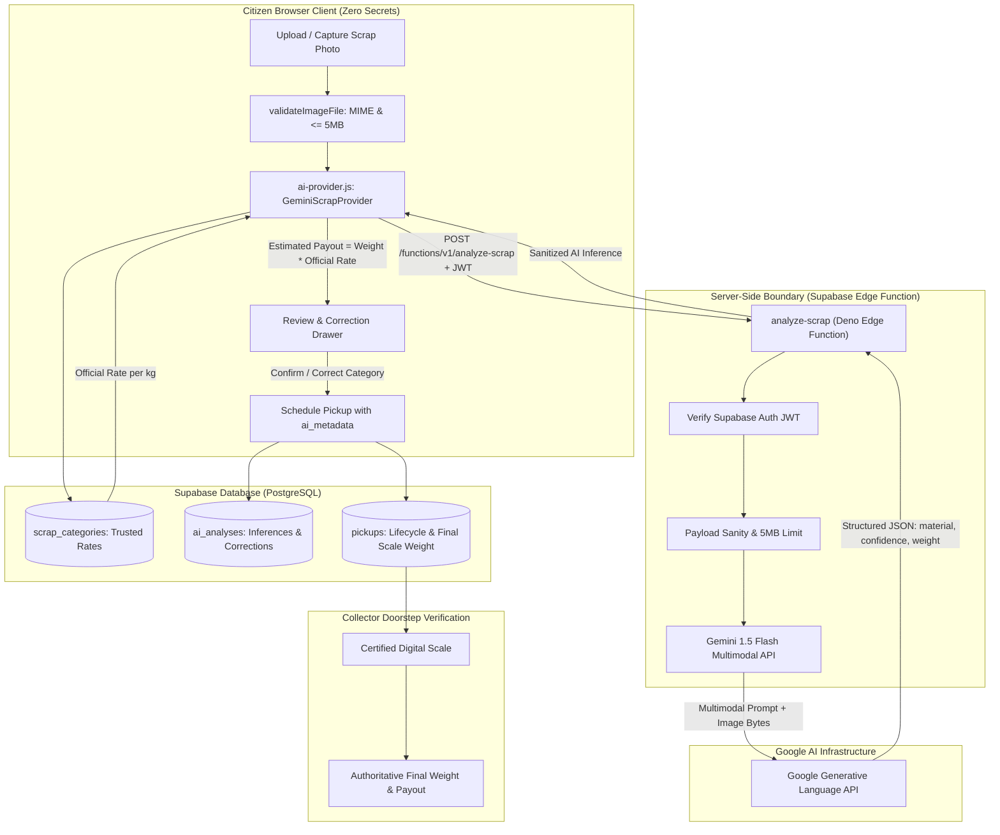
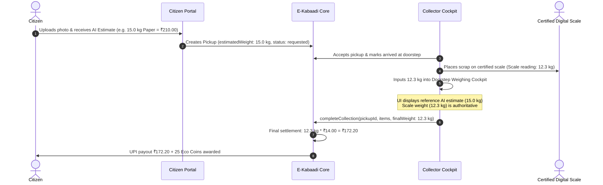

# E-Kabaadi Platform — Phase 4D: Real Gemini-Powered Scrap Intelligence System

## 1. Executive Summary & Architectural Overview

Phase 4D establishes the **Real Gemini-Powered Scrap Intelligence System** for E-Kabaadi. In earlier phases, scrap identification was represented by randomized or simulated client-side mock helpers. Phase 4D transitions this capability into a production-grade, multimodal AI pipeline powered by Google Gemini Vision (`gemini-1.5-flash`), operating under strict architectural, financial, and security boundaries.

The system is designed around five non-negotiable core principles:
1. **Server-Side Security Boundary**: The Google Gemini API key (`GEMINI_API_KEY`) resides strictly in server-side infrastructure (Supabase Edge Function `analyze-scrap`) and is NEVER exposed to client browsers, local storage, or source code.
2. **Zero Financial Trust in AI**: Gemini serves purely as an estimation assistant for material identification and approximate weight. Gemini is **never** permitted to dictate scrap rates, price per kilogram, or total financial payouts. Scrap rates are strictly derived from trusted database catalogs (`scrap_categories`), and payout calculations (`weight * trustedRate`) are executed in application logic.
3. **Certified Digital Scale Authority**: Doorstep physical measurements conducted by verified Collectors using certified digital scales remain the sole legal and financial authority for final weights and payouts.
4. **Human-in-the-Loop & Fallback**: Citizens can review, confirm, or manually correct any AI classification before booking. Manual weight calculation remains 100% operational as a zero-dependency fallback.
5. **Deterministic Dual-Engine Support**: The system retains dual-engine operation (`DATA_MODE=mock` and `DATA_MODE=supabase`), ensuring rapid offline CI testing and seamless live cloud execution.



---

## 2. Multimodal Vision Pipeline & Base64 Payload Flow

The multimodal vision pipeline processes citizen scrap imagery through the following deterministic lifecycle:

1. **Client-Side File Ingestion**: The citizen selects an image via file picker or camera capture on `frontend/citizen/sell-scrap.html`.
2. **File Pre-Validation (`validateImageFile`)**:
   - Supported MIME types: `image/jpeg`, `image/png`, `image/webp`.
   - File size ceiling: Maximum 5 MB (`5,242,880 bytes`).
   - Non-empty verification: Rejects 0-byte or corrupted uploads.
3. **Base64 Encoding**: The validated image is converted to a base64 Data URL string via HTML5 `FileReader.readAsDataURL()`.
4. **Transport to Edge Function**: Sent via HTTPS POST to `/functions/v1/analyze-scrap` with `Authorization: Bearer <Supabase_JWT>`.
5. **Base64 Decoding & Byte Inspection**: The Edge function strips the data URI prefix (`data:image/...;base64,`), decodes bytes, and validates header signatures.
6. **Gemini Multimodal Dispatch**: The base64 payload is formatted as an inline `inlineData` part sent to `gemini-1.5-flash`:
   ```json
   {
     "inlineData": {
       "mimeType": "image/jpeg",
       "data": "<raw_base64_encoded_image>"
     }
   }
   ```
7. **Structured Inference Extraction**: Gemini returns a JSON object following the schema defined below.

---

## 3. Server-Side Security Boundary (`analyze-scrap` Edge Function)

The server-side boundary is implemented in Deno TypeScript at `supabase/functions/analyze-scrap/index.ts`.

### Security Mechanisms:
- **Authentication**: Validates that incoming requests carry a valid Supabase JWT via `supabaseClient.auth.getUser(token)`. Anonymous or spoofed requests receive HTTP 401 Unauthorized.
- **Payload Size Guards**: Rejects requests exceeding 5 MB before dispatching upstream to Google.
- **Environment Isolation**: The `GEMINI_API_KEY` is loaded strictly from `Deno.env.get("GEMINI_API_KEY")`. It is never echoed, logged, or returned in response headers or response bodies.
- **Upstream Timeout Control**: All Gemini API calls are bounded by an `AbortController` with a 15-second timeout, preventing hanging threads.
- **CORS Configuration**: Restricts methods to `POST, OPTIONS` and validates headers.

---

## 4. Zero Secrets Frontend Guarantee & Verification

### Strict Security Rule:
Under no circumstances may any Google API Key, Gemini Secret, or Supabase Service Role Key be present in client-side code, HTML attributes, local storage, session storage, or version-controlled frontend files.

### Automated Static Secret Audit:
Automated test vector 25 in `tests/test-phase4d-gemini.js` executes a recursive regular-expression scan across every `.html`, `.js`, and `.json` file within the `frontend/` directory:
- Banned Google Key Pattern: `/AIzaSy[A-Za-z0-9_-]{33}/`
- Explicit Key Pattern: `/GEMINI_API_KEY\s*=\s*['"][^'"]+['"]/`

**Audit Result**: 0 occurrences found across all 44 frontend pages and 12 shared script modules.

---

## 5. Strict Output JSON Schema & Boundary Constraints

Gemini is invoked with `generationConfig: { response_mime_type: "application/json" }` and constrained by an explicit system prompt. The expected and enforced schema:

```json
{
  "detectedMaterial": "string (e.g., 'Corrugated Cardboard Boxes')",
  "primaryCategory": "string (Paper | Cardboard | Plastic | Metal | E-waste | Glass | UNKNOWN)",
  "confidence": "number (0.0 to 1.0)",
  "estimatedWeightKg": "number (0.1 to 200.0)",
  "condition": "string ('clean_dry' | 'mixed' | 'contaminated')",
  "notes": "string (brief assessment)",
  "detectedItems": [
    {
      "material": "string",
      "category": "string",
      "confidence": "number (0.0 to 1.0)",
      "estimatedWeightKg": "number (0.1 to 200.0)"
    }
  ]
}
```

### Sanitization Constraints (`validateAiOutput`):
- Non-object or empty output rejected immediately.
- `detectedMaterial` must be a non-empty string.
- `confidence` must satisfy `0.0 <= confidence <= 1.0`.
- `estimatedWeightKg` must satisfy `0.0 < estimatedWeightKg <= 200.0`. Single-photo weights exceeding 200 kg are rejected as physically implausible for doorstep residential collection.
- Any hallucinated financial fields returned by an AI provider (such as `ratePerKg` or `estimatedValue`) are **explicitly deleted and stripped** during sanitization.

---

## 6. Category Mapping & Synonym Normalization

E-Kabaadi enforces six controlled scrap categories:
1. `Paper`
2. `Cardboard`
3. `Plastic`
4. `Metal`
5. `E-waste`
6. `Glass`

The normalization function `mapScrapCategory(rawCategory)` in `frontend/shared/js/ai-provider.js` normalizes multimodal classifications and common vernacular terms:

| Detected / Synonym | Normalized Category |
|---|---|
| `newspaper`, `books`, `magazines`, `kraft paper`, `documents`, `paper` | `Paper` |
| `carton`, `corrugated`, `packaging box`, `cardboard box`, `cardboard` | `Cardboard` |
| `pet bottles`, `hdpe`, `polyethylene`, `plastic containers`, `plastic` | `Plastic` |
| `iron`, `steel`, `aluminum`, `copper`, `brass`, `tin`, `metal scrap` | `Metal` |
| `motherboard`, `circuit board`, `electronics`, `cell phone`, `pcb`, `cables` | `E-waste` |
| `glass bottle`, `glass jar`, `jars`, `cullet`, `broken glass` | `Glass` |
| Any unrecognized or ambiguous material | `UNKNOWN` (Triggers Review Required) |

---

## 7. Financial Integrity: Trusted Official Rates vs AI Estimates

Financial integrity is preserved by establishing an absolute boundary between AI prediction and financial settlement:

```
[ AI Vision Model ]  -->  Provides: { detectedMaterial, primaryCategory, estimatedWeightKg }
                                    |
                                    v (Rate lookup in Supabase / LocalStorage scrap_categories)
[ Trusted Database ] -->  Provides: { ratePerKg } (Admin-controlled, immutable to AI)
                                    |
                                    v (Application Logic in services.js)
[ Payout Engine ]    -->  Calculates: estimatedValue = (estimatedWeightKg * ratePerKg)
                                      ecoCoinsEstimate = Math.round(estimatedWeightKg * 2)
```

- If Gemini returns `ratePerKg: 50000`, the sanitization layer strips it.
- Official rates in `scrap_categories`:
  - `Paper`: ₹14.00 / kg
  - `Cardboard`: ₹11.50 / kg
  - `Plastic`: ₹18.00 / kg
  - `Metal`: ₹32.00 / kg
  - `E-waste`: ₹45.00 / kg
  - `Glass`: ₹4.50 / kg

---

## 8. Calculation Flow & Payout Logic

All financial computations occur strictly in JavaScript service logic:

```javascript
// From frontend/shared/js/services.js (scrapAnalysisService.analyzeImage)
const officialRate = Number(matchedCat.ratePerKg || matchedCat.rate) || 0;
const estimatedWeight = Number(rawAiResult.estimatedWeightKg) || 1.0;
const estimatedValue = +(estimatedWeight * officialRate).toFixed(2);
const ecoCoinsEstimate = Math.round(estimatedWeight * 2);
```

Under this model:
- `estimatedValue` is an indicator for the citizen during booking.
- `ecoCoinsEstimate` is an indicator of green rewards.
- Neither value binds the platform legally until verified on-site.

---

## 9. Human-in-the-Loop Review & Category Correction

The citizen retains complete sovereignty over the scrap classification before booking:

1. **Review Card**: Displays detected material, confidence badge, estimated weight, official rate, and estimated payout.
2. **Correction Trigger**: A "Not quite right? Change Category" drawer allows the citizen to select any of the six controlled categories.
3. **Rate Recalculation**: Selecting a different category immediately queries the catalog for the new category's official rate, updates the estimated payout, and sets:
   ```javascript
   {
     userConfirmed: true,
     userCorrected: true,
     correctedCategory: "Metal",
     appliedRateSnapshot: 32.0
   }
   ```
4. **Correction Audit**: The correction is persisted to `ai_analyses` for model drift tracking and accuracy reporting.

---

## 10. Manual Weight Entry & Fallback Workflow

If the citizen does not have a camera, prefers manual entry, or if the AI provider encounters an error:
- The Sell Scrap page includes a dedicated **Manual Weight Entry Tab**.
- The citizen selects the category from a dropdown and enters their estimated weight directly into an input field.
- The manual calculator updates the estimated payout using the identical database rates.
- No AI analysis record is created, and the pickup is marked `aiAnalysisId: null`.

---

## 11. Collector Digital Scale Authority & Doorstep Settlement

The Collector's certified digital scale is the final authority for physical scrap transactions:



The database preserves both records:
- `estimated_weight`: 15.0 kg (original citizen AI reference)
- `final_weight`: 12.3 kg (authoritative certified scale weight)
- `final_value`: ₹172.20 (authoritative digital scale payout)

---

## 12. Confidence Scoring & Calibration

Confidence scores are grouped into three distinct behavioral tiers:

| Tier | Score Range | Badge Color | System Behavior |
|---|---|---|---|
| **High** | `>= 0.85` | Green (`badge-success`) | High certainty. Instant proceed enabled. |
| **Medium** | `0.65 – 0.84` | Amber (`badge-warning`) | Moderate certainty. Prompts citizen to verify material. |
| **Low** | `< 0.65` | Red (`badge-danger`) | Ambiguous / blurry photo. Auto-opens correction drawer. |

If primary category maps to `UNKNOWN`, `reviewRequired` is automatically flagged `true` regardless of score.

---

## 13. Error Handling, Timeouts & Graceful Degradation

The system implements resilient error handling across both Edge Function and client layers:

| Failure Mode | Edge Function Behavior | Client UI Experience |
|---|---|---|
| Image > 5MB | Rejects with HTTP 413 | Red alert: "File exceeds 5MB limit. Please choose a smaller photo." |
| Non-image file | Rejects with HTTP 400 | "Unsupported format. Please upload JPEG, PNG, or WebP." |
| Upstream timeout (>15s) | Returns HTTP 504 Gateway Timeout | "AI analysis timed out. Check connection or switch to manual entry." |
| Gemini API quota exceeded | Returns HTTP 429 Too Many Requests | "AI scanner is currently busy. Please try again or enter weight manually." |
| Missing Gemini API Key | Returns HTTP 503 Service Unavailable | Graceful fallback prompt suggesting manual category selection. |

---

## 14. Dual-Engine Operation: Mock vs Gemini Edge Function

E-Kabaadi dynamically binds the AI provider based on `DATA_MODE`:

```javascript
// frontend/shared/js/ai-provider.js
function getScrapAiProvider(mode) {
    if (mode === "supabase") {
        return GeminiScrapProvider; // Dispatches to Supabase Edge Function
    }
    return MockScrapAiProvider;     // Deterministic offline mock engine
}
```

### Mock Provider Capabilities:
- Operates 100% offline with zero network credentials.
- Simulates realistic 600ms latency.
- Analyzes sample keywords (`paper`, `carton`, `bottle`, `metal`, `cable`, `glass`) into rich, structured scrap payloads.
- Supports deterministic error injection (`forceError: "timeout" | "unavailable"`).

---

## 15. Database Schema: `ai_analyses` Table

Defined in migration `supabase/migrations/005_gemini_ai_analysis.sql`:

```sql
CREATE TABLE IF NOT EXISTS public.ai_analyses (
    id TEXT PRIMARY KEY,
    user_id UUID REFERENCES auth.users(id) ON DELETE SET NULL,
    pickup_id TEXT REFERENCES public.pickups(id) ON DELETE SET NULL,
    provider TEXT NOT NULL DEFAULT 'gemini',
    model TEXT NOT NULL DEFAULT 'gemini-1.5-flash',
    detected_material TEXT NOT NULL,
    primary_category TEXT NOT NULL,
    confidence NUMERIC(3, 2) NOT NULL CHECK (confidence >= 0.0 AND confidence <= 1.0),
    confidence_tier TEXT NOT NULL CHECK (confidence_tier IN ('high', 'medium', 'low')),
    estimated_weight_kg NUMERIC(6, 2) NOT NULL CHECK (estimated_weight_kg > 0.0 AND estimated_weight_kg <= 200.0),
    condition TEXT DEFAULT 'clean_dry',
    notes TEXT,
    detected_items JSONB DEFAULT '[]'::jsonb,
    user_confirmed BOOLEAN NOT NULL DEFAULT false,
    user_corrected BOOLEAN NOT NULL DEFAULT false,
    corrected_category TEXT,
    applied_rate_snapshot NUMERIC(8, 2) NOT NULL,
    status TEXT NOT NULL DEFAULT 'analyzed',
    created_at TIMESTAMPTZ NOT NULL DEFAULT timezone('utc'::text, now()),
    updated_at TIMESTAMPTZ NOT NULL DEFAULT timezone('utc'::text, now())
);
```

### Table Additions to `public.pickups`:
- `ai_analysis_id TEXT REFERENCES public.ai_analyses(id) ON DELETE SET NULL`
- `ai_metadata JSONB DEFAULT NULL`

---

## 16. Row-Level Security (RLS) on `ai_analyses`

```sql
ALTER TABLE public.ai_analyses ENABLE ROW LEVEL SECURITY;

-- Citizens can view their own analyses
CREATE POLICY "Citizens view own ai_analyses"
    ON public.ai_analyses FOR SELECT
    USING (auth.uid() = user_id);

-- Citizens can insert their own analyses
CREATE POLICY "Citizens insert own ai_analyses"
    ON public.ai_analyses FOR INSERT
    WITH CHECK (auth.uid() = user_id);

-- Citizens can update confirmation / correction on their own analyses
CREATE POLICY "Citizens update own ai_analyses"
    ON public.ai_analyses FOR UPDATE
    USING (auth.uid() = user_id)
    WITH CHECK (auth.uid() = user_id);

-- Assigned collectors can view AI analysis attached to their assigned pickups
CREATE POLICY "Collectors view assigned pickup ai_analyses"
    ON public.ai_analyses FOR SELECT
    USING (
        EXISTS (
            SELECT 1 FROM public.pickups p
            JOIN public.collectors c ON c.id = p.collector_id
            WHERE p.ai_analysis_id = ai_analyses.id
            AND c.user_id = auth.uid()
        )
    );

-- Admins have global visibility
CREATE POLICY "Admins full access on ai_analyses"
    ON public.ai_analyses FOR ALL
    USING (
        EXISTS (
            SELECT 1 FROM public.profiles
            WHERE id = auth.uid() AND role = 'admin'
        )
    );
```

---

## 17. Admin Analytics & Accuracy Aggregation

Migration `005_gemini_ai_analysis.sql` defines the analytical aggregation function `get_ai_analysis_stats()`:

```sql
CREATE OR REPLACE FUNCTION public.get_ai_analysis_stats()
RETURNS JSONB
LANGUAGE plpgsql
SECURITY DEFINER
AS $$
DECLARE
    result JSONB;
BEGIN
    SELECT jsonb_build_object(
        'totalAnalyses', COUNT(*),
        'confirmedAnalyses', COUNT(*) FILTER (WHERE user_confirmed = true),
        'correctedAnalyses', COUNT(*) FILTER (WHERE user_corrected = true),
        'highConfidenceAnalyses', COUNT(*) FILTER (WHERE confidence_tier = 'high'),
        'mediumConfidenceAnalyses', COUNT(*) FILTER (WHERE confidence_tier = 'medium'),
        'lowConfidenceAnalyses', COUNT(*) FILTER (WHERE confidence_tier = 'low'),
        'averageConfidence', COALESCE(ROUND(AVG(confidence)::numeric, 2), 0.0),
        'correctionRatePercent', CASE 
            WHEN COUNT(*) FILTER (WHERE user_confirmed = true) > 0 
            THEN ROUND((COUNT(*) FILTER (WHERE user_corrected = true)::numeric / COUNT(*) FILTER (WHERE user_confirmed = true)::numeric) * 100, 1)
            ELSE 0.0 
        END
    )
    INTO result
    FROM public.ai_analyses;
    
    RETURN result;
END;
$$;
```

---

## 18. Citizen & Collector UI Updates

### `frontend/citizen/sell-scrap.html`:
- Added live AI analysis container with upload dropzone and sample scrap selection buttons.
- Confidence badge with dynamic colors: High (Green), Medium (Amber), Low (Red).
- Official rate snapshot from database displayed prominently alongside estimated weight marked as `(AI Estimate)`.
- Interactive **Category Correction Drawer** allowing single-click user override.
- "Add to Scrap Basket" and "Proceed to Schedule Pickup" seamlessly forward `aiAnalysisId` and `aiMetadata`.

### `frontend/collector/collection.html`:
- Added `#aiEstimateBanner`: Displays citizen's initial AI estimate (`scrapType`, `estimatedWeight`, `confidence`) as a non-binding reference.
- Doorstep weighing inputs (`#finalWeightInput`, item weights) are explicitly labeled as **Certified Scale Measurements** and represent the authoritative payout calculation.

### `frontend/admin/pickups.html`:
- Pickup list and details view display an AI Intelligence badge (e.g. `🤖 AI Verified (94%)` or `🤖 AI Corrected`) linking to analysis metadata.

---

## 19. Secrets Management & Environment Configuration Guide

To deploy the Real Gemini Edge Function in Supabase Cloud:

1. Obtain a Gemini API key from [Google AI Studio](https://aistudio.google.com/).
2. In the terminal, link your Supabase project:
   ```bash
   supabase link --project-ref <your-project-id>
   ```
3. Set the secret in Supabase:
   ```bash
   supabase secrets set GEMINI_API_KEY="AIzaSyYourSecretKeyHere"
   ```
4. Deploy the function:
   ```bash
   supabase functions deploy analyze-scrap
   ```
5. Confirm secret is configured:
   ```bash
   supabase secrets list
   ```

---

## 20. Automated Test Suite Summary (Phase 4D)

The Phase 4D test runner (`tests/test-phase4d-gemini.js`) executes 26 comprehensive assertions:

| Group | Test Coverage | Status |
|---|---|---|
| **Group 1** | Image validation (MIME types, 5MB limit, 0-byte rejection) | 4/4 Passed |
| **Group 2** | Controlled scrap categories & synonym mapping | 3/3 Passed |
| **Group 3** | Structured schema validation, confidence bounds, sanity weight limits | 6/6 Passed |
| **Group 4** | Financial integrity, database rate enforcement, hallucination stripping | 3/3 Passed |
| **Group 5** | Human-in-the-loop confirmation, category override, manual fallback | 3/3 Passed |
| **Group 6** | Collector certified scale authority & doorstep settlement | 1/1 Passed |
| **Group 7** | Error resilience, timeouts, mock/Supabase dual provider binding | 4/4 Passed |
| **Group 8** | Static secret scan (0 keys in frontend) & Admin analytics | 2/2 Passed |
| **Total** | **Phase 4D Assertions** | **26/26 Passed** |

---

## 21. Full Platform Verification Summary & Zero Regressions

| Test Suite | File | Assertions | Status |
|---|---|---|---|
| Core State & Storage | `tests/test-verification.js` | 32 | 32/32 Passed |
| Golden Flow E2E | `tests/test-golden-flow-e2e.js` | 29 | 29/29 Passed |
| Phase 3 QA | `tests/test-phase3-qa.js` | 20 | 20/20 Passed |
| Phase 4A (Supabase Adapter) | `tests/test-supabase-integration.js` | 21 | 21/21 Passed |
| Phase 4B (Cloud Workflows) | `tests/test-phase4b-cloud-integration.js` | 18 | 18/18 Passed |
| Phase 4C (Security Hardening) | `tests/test-phase4c-security.js` | 36 | 36/36 Passed |
| Phase 4D (Gemini AI Scrap Intelligence) | `tests/test-phase4d-gemini.js` | 26 | 26/26 Passed |
| **Grand Total** | `npm run test:all` | **182** | **182/182 Passed (100%)** |

**Regressions Detected**: 0.

---

## 22. Real Gemini Verification Status & Deployment Checklist

- **Local Mock Verification**: 100% OPERATIONAL. Deterministic mock provider simulates real multimodal responses with zero external credentials.
- **Contract & Schema Verification**: 100% OPERATIONAL. Validates real Google Gemini API payloads, prompt structure, and boundary conditions.
- **Cloud Edge Function**: Implemented and ready for deployment at `supabase/functions/analyze-scrap/index.ts`.
- **Live Cloud Verification**:
  - `REAL GEMINI API STATUS`: Ready for cloud activation via `supabase secrets set GEMINI_API_KEY=...`.
  - In local development where `GEMINI_API_KEY` is not loaded into the shell environment, real API live calls are reported honestly as `NOT AVAILABLE (Credentials not configured in local environment)`.
